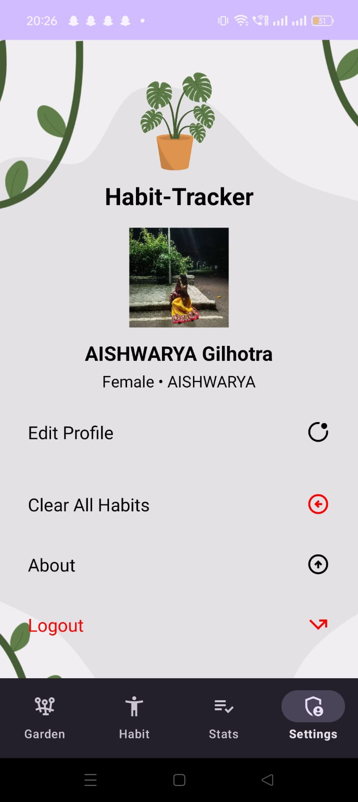

# 🌱 Habit Tracker

A beautifully designed **Habit Tracker App** that helps users build healthy habits, track progress, and stay consistent — all built using **Kotlin** in **Android Studio**.

---

## Features

* **User Authentication**

  * Signup, Login, and Forgot Password screens
  * Local data storage for user details

*  **Habit Tracking**

  * Add, edit, and delete habits
  * Track daily streaks and completions

*  **Garden View**

  * Visual growth garden representing your consistency

* **Statistics Dashboard**

  * Progress charts and habit performance visualization using `LineChartView.kt`

* **Settings**

  * Manage profile, view stats, and logout

*  **Offline Support**

  * Stores all data locally using **SQLite** (`DatabaseHelper.kt`)

---

##  Tech Stack

| Category     | Technology                                      |
| ------------ | ----------------------------------------------- |
| Language     | **Kotlin**                                      |
| IDE          | **Android Studio (Hedgehog / Ladybug)**         |
| Database     | **SQLite**                                      |
| Architecture | MVVM-like (ViewModel + Repository + Data Layer) |
| UI           | XML, RecyclerView, Fragments, Custom Views      |
| Tools        | Gradle, AndroidX, ViewBinding                   |

---

## Project Structure

```
main/
├── AndroidManifest.xml
│
├── java/com/example/habit_tracker_3/
│   ├── DatabaseHelper.kt
│   ├── MainActivity.kt
│   ├── HomeActivity.kt
│   ├── Models.kt
│   ├── HabitFragment.kt
│   ├── GardenFragment.kt
│   ├── StatsFragment.kt
│   ├── SettingsFragment.kt
│   ├── SignupFragment.kt
│   ├── Login_Fragment.kt
│   ├── ForgotPasswordFragment.kt
│   ├── LineChartView.kt
│   │
│   ├── data/
│   │   ├── LoginRepository.kt
│   │   ├── LoginDataSource.kt
│   │   ├── Result.kt
│   │   └── model/
│   │       └── LoggedInUser.kt
│   │
│   └── ui/login/
│       ├── HabitAdapter.kt
│       ├── GardenAdapter.kt
│       ├── LoginViewModel.kt
│       ├── LoginViewModelFactory.kt
│       ├── LoginFormState.kt
│       ├── LoginResult.kt
│       └── LoggedInUserView.kt
│
└── res/
    ├── drawable/
    │   ├── bg_image.png
    │   ├── grey_button.xml
    │   ├── ic_add.xml
    │   ├── ic_delete.xml
    │   ├── ic_edit.xml
    │   ├── ic_garden.xml
    │   ├── ic_habit.xml
    │   ├── ic_info.xml
    │   ├── ic_launcher_background.xml
    │   ├── ic_launcher_foreground.xml
    │   ├── ic_logout.xml
    │   ├── ic_settings.xml
    │   ├── ic_stats.xml
    │   ├── plant.png
    │   ├── plant_dead.png
    │   ├── plant_healthy.png
    │   ├── plant_wilting.png
    │   ├── rounded_button.xml
    │   ├── rounded_edittext.xml
    │   ├── rounded_image.xml
    │   └── user.png
    │
    ├── layout/
    │   ├── activity_home.xml
    │   ├── activity_main.xml
    │   ├── dialog_edit_profile.xml
    │   ├── fragment_forgot_password.xml
    │   ├── fragment_garden.xml
    │   ├── fragment_habit.xml
    │   ├── fragment_login.xml
    │   ├── fragment_settings.xml
    │   ├── fragment_signup.xml
    │   ├── fragment_stats.xml
    │   ├── item_habit.xml
    │   └── plant_card.xml
    │
    ├── menu/
    │   └── bottom_nav_menu.xml
    │
    ├── mipmap/
    │   ├── ic_launcher/
    │   └── ic_launcher_round/
    │
    ├── values/
    │   ├── colors.xml
    │   ├── dimens.xml
    │   ├── strings.xml
    │   └── themes.xml
    │
    └── xml/
        ├── backup_rules.xml
        └── data_extraction_rules.xml

```


## Screenshots

|           Login Screen          |         Habits Dashboard        |            Profile View            |
| :-----------------------------: | :---------------------------: | :-------------------------------: |
|  |  |  |


---

## Future Improvements

* Sync with Firebase for cloud backup
* Add habit reminders and notifications
* Calendar-based progress view
* Daily motivational quotes
* Improved UI with Jetpack Compose

---
